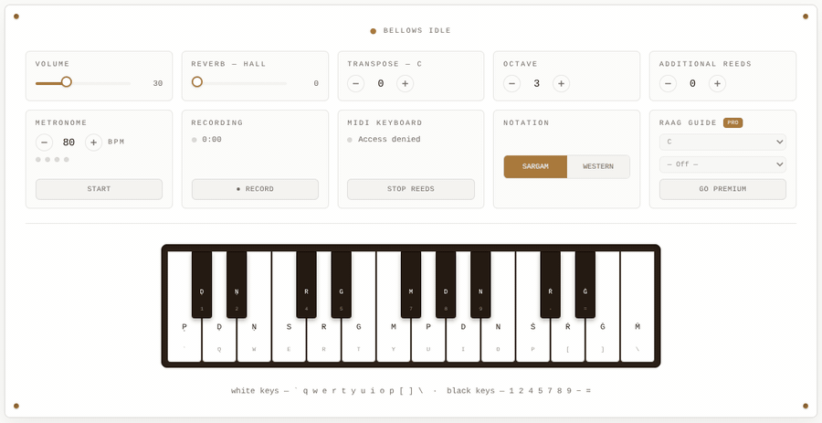

# Pocket Harmonium

Play a real recorded Indian harmonium in your browser — sargam keyboard, reed
stacking, chord detection, metronome, recording, and a raag guide.



**Live demo:** https://pocketharmonium.vercel.app

## Features

- **Real recorded reeds** — every key is a sampled harmonium reed, pitch-shifted across the keyboard.
- **Sargam or Western labels** — switch the key labels between Sa Re Ga Ma and C D E F.
- **Raag Guide** — pick a root note and one of ten common raags (Yaman, Bilawal, Bhairav, Bhairavi, Kafi, Asavari, Khamaj, Bhupali, Marwa, Todi) and the notes of that raag light up on the keyboard. Free for everyone.
- **Built for riyaz** — metronome, one-click recording, transposition and reed stacking.
- **Remembers your setup** — volume, reverb, transpose, octave, reeds, BPM and your raag choice are restored the next time you visit.

## Stack

- [TanStack Start](https://tanstack.com/start) (React 19, SSR)
- [Tailwind CSS v4](https://tailwindcss.com)
- [shadcn/ui](https://ui.shadcn.com) components (Radix UI primitives)
- [Nitro](https://nitro.build) server build

## Development

You'll need [Bun](https://bun.sh) (or Node.js 20+ with npm) installed.

```sh
bun install
bun run dev
```

The app runs at http://localhost:3000 by default.

## Available scripts

```sh
bun run dev        # start the dev server
bun run build      # production build
bun run preview     # preview the production build locally
bun run lint        # run ESLint
```
